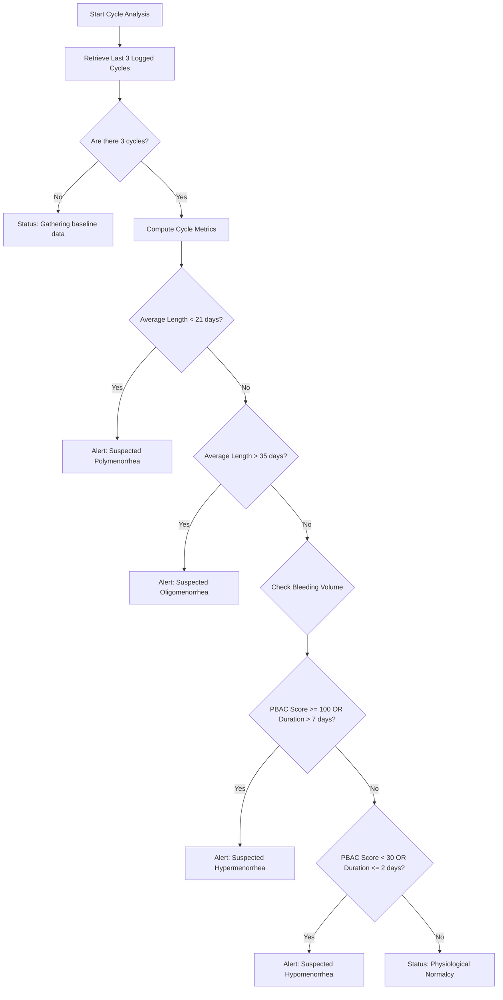

# Clinical Research: Menstrual Volume & Frequency Abnormalities

This document details the physiological definitions, clinical baselines, and assessment algorithms planned for Selene's future clinical insights engine.

---

## 🩸 1. Clinical Classifications

Menstrual cycle abnormalities are grouped into two primary dimensions: **Frequency** (timing of ovulation and bleeding) and **Volume** (amount of blood loss).

```
MENSTRUAL DISORDERS
 ├── Frequency (Days)
 │    ├── Polymenorrhea  (<21 days)
 │    └── Oligomenorrhea (>35 days)
 └── Volume (Volume/Duration)
      ├── Hypomenorrhea  (<30 mL or <2 days)
      └── Hypermenorrhea (>80 mL or >7 days)
```

### A. Oligomenorrhea (Infrequent Cycles)
*   **Definition:** Menstrual periods occurring at intervals greater than 35 days (typically 36 to 90 days), resulting in fewer than 9 periods per year.
*   **Physiological Cause:** Frequently caused by **anovulation** (failure of the ovary to release an egg), which is common in conditions such as Polycystic Ovary Syndrome (PCOS), thyroid dysfunction, high prolactin, or hypothalamic amenorrhea (stress, intensive exercise, low weight).

### B. Hypomenorrhea (Unusually Light Flow)
*   **Definition:** Menstrual blood loss that is abnormally light in volume (under 30 mL total) or short in duration (2 days or fewer).
*   **Physiological Cause:** Can be caused by low hormone levels (e.g. low estrogen resulting in a thin uterine lining), use of hormonal contraceptives, thyroid disorders, or Asherman's syndrome (uterine scarring).

### C. Hypermenorrhea / Menorrhagia (Heavy Menstrual Bleeding)
*   **Definition:** Total blood loss exceeding 80 mL per cycle, or bleeding duration exceeding 7 consecutive days.
*   **Physiological Cause:** Anovulation (prolonged estrogen exposure without progesterone stabilization, leading to irregular shedding of a thickened lining), uterine fibroids, endometrial polyps, adenomyosis, or copper intrauterine devices (IUDs).

### D. Polymenorrhea (Frequent Cycles)
*   **Definition:** Menstrual cycle intervals shorter than 21 days.
*   **Physiological Cause:** Shortened follicular phase or luteal phase defect (where the corpus luteum fails early, leading to premature lining breakdown).

---

## 📊 2. Menstrual Blood Loss (MBL) Estimation

Since laboratory fluid extraction is not possible in a consumer tracking environment, Selene will utilize the **Pictorial Blood Loss Assessment Chart (PBAC)** method to estimate blood loss:

### The PBAC Score Reference
Users log sanitary products used daily and their saturation levels. Scores are assigned as follows:

| Product | Saturation Level | PBAC Points | Estimated Fluid Loss ($mL$) |
| :--- | :--- | :--- | :--- |
| **Pads (Sanitary)** | Lightly soiled (Spotting) | 1 point | $\sim 1\text{ mL}$ |
| | Moderately soiled | 5 points | $\sim 5\text{ mL}$ |
| | Fully saturated | 20 points | $\sim 20\text{ mL}$ |
| **Tampons** | Lightly soiled | 1 point | $\sim 1\text{ mL}$ |
| | Moderately soiled | 5 points | $\sim 5\text{ mL}$ |
| | Fully saturated | 20 points | $\sim 20\text{ mL}$ |
| **Menstrual Cup** | Measured volume marks | Actual value | Direct measurement |

### Clinical Threshold for Menorrhagia:
A **cumulative PBAC score of $\ge 100$** during a single cycle has been validated to correlate with a blood loss exceeding the **80 mL clinical threshold** for Heavy Menstrual Bleeding (HMB).

---

## ⚙️ 3. Proposed Detection Algorithms

To prevent false alarms from temporary fluctuations (due to travel, acute stress, or mild illness), the diagnostics engine requires a **minimum of 3 consecutive completed cycles** to confirm a clinical trend.

### Flowchart: Clinical Insight Detection Logic



---

## 🛡️ 4. Medical Disclaimer & Guardrails

Selene is designed for educational health tracking, not medical diagnosis. When presenting insights, the system must adhere to strict regulatory compliance guidelines:

*   **Warning Indicators:** Insights will be labeled as "Suspected Cycle Variations" or "Flow Variations" rather than diagnostic determinations.
*   **Doctor Export PDF:** Provide a clean formatting option for users to export their cycle calendar, symptothermal tables, and PBAC statistics directly to present to their gynaecologist.
*   **Safety Thresholds:** If any cycle bleeding exceeds 10 consecutive days or is accompanied by severe localized pain symptoms, the system will trigger an immediate recommendation to consult a medical professional.
